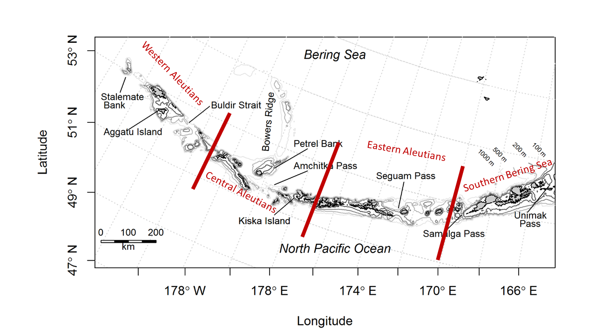

```{r setup, include=FALSE}
library(knitr)
library(ggplot2)
library(gridExtra)
library(GroundfishCondition)
#data("lwdata")
#lwdata["YEAR"]<-round(lwdata["CRUISE"]/100,digits=1)
#head(lwdata)

```

## Aleutian Islands Groundfish Condition
Contributed by Jennifer Boldt^1^, Chris Rooper^1^ , and Jerry Hoff^2^   
^1^ Fisheries and Oceans Canada, Pacific Biological Station, 3190 Hammond Bay Rd, Nanaimo, BC, Canada V9T 6N7  
^2^ Resource Assessment and Conservation Engineering Division, Alaska Fisheries Science Center, National Marine Fisheries Service, NOAA  
**Contact**: chris.rooper@dfo-mpo.gc.ca  
**Last updated**:  October 2018

**Description of Indicator**: Length-weight residuals are an indicator of somatic growth (Brodeur et al. 2004) and, therefore, a measure of fish condition. Fish condition is an indicator of how heavy a fish is per unit body length, and may be an indicator of ecosystem productivity. Positive length-weight residuals indicate fish are in better condition (i.e., heavier per unit length); whereas, negative residuals indicate fish are in poorer condition (i.e., lighter per unit length). Fish condition may affect fish growth and subsequent survival (Paul 1997, Boldt and Haldorson 2004).

```{r map, include=TRUE,out.width="200%",fig.cap="\\label{fig:figs}Figure 1. NMFS summer bottom trawl survey strata in the Aleutian Islands. Red lines demarcate Aleutian Islands INPFC Areas",  echo=FALSE}
 
```

The AFSC Aleutian Islands bottom trawl survey data was utilized to acquire lengths and weights of individual fish for walleye pollock, Pacific cod, arrowtooth flounder, southern rock sole, Atka mackerel, northern rockfish, and Pacific ocean perch.  Only standard survey stations were included in analyses.  Data were combined by INPFC area; Southern Bering sea, Eastern Aleutian Islands, Central Aleutian Islands, and Western Aleutian Islands (Figure 1). Length-weight relationships for each of the seven species were estimated with a linear regression of log-transformed values over all years where data was available (during 1984-2018). Additionally, length-weight relationships for age 1+ walleye pollock (length from 100-250 mm) were also calculated independent from the adult life history stage. Predicted log-transformed weights were calculated and subtracted from measured log-transformed weights to calculate residuals for each fish. Outliers were removed using a Bonferroni outlier test (with a cutoff test statistic of 0.7 for removal). Length-weight residuals were averaged for the entire AI and for the 3 INPFC areas sampled in the standard summer survey.  Temporal and spatial patterns in residuals were examined.  

**Status and Trends**: Length-weight residuals varied over time for all species with a few notable patterns (Figure 2).  Residuals for most species where there was data were negative from 2000 to 2006.  Residuals were positive for all species but southern rock sole in 2010. In 2012-2016 length-weight residuals were negative across most species and the trendline has been negative since 2010. For northern rockfish, Pacific cod and Pacific ocean perch there has been a declining trend in residuals over the years covered by the survey and condition in the last four surveys has been particularly negative. 


```{r figure 2 set up, include=FALSE, fig.height=4, fig.width=4,message=FALSE, warning=FALSE}
##AI Calculations and figures
AI.species<-c(21740,21741,21720,30420,10262,10110,30060,21921)
AI.speciesnames<-c("Walleye pollock","Age 1 Walleye Pollock","Pacific cod","Northern rockfish","Southern rock sole","Arrowtooth flounder","Pacific Ocean perch","Atka mackerel")
AI.lwdata<-subset(lwdata,lwdata["REGION"]=="AI")
AI.lwdata<-subset(AI.lwdata,AI.lwdata$YEAR>1984&AI.lwdata$YEAR!=1989)
AI.lwdata$SPECIES_CODE<-ifelse(AI.lwdata$SPECIES_CODE==21740&AI.lwdata$LENGTH<250&AI.lwdata$LENGTH>=100, 21741, AI.lwdata$SPECIES_CODE)
AI.lwdata<-subset(AI.lwdata,AI.lwdata["INPFC_AREA"]!="")
AI.lwdata$YEAR<-round(AI.lwdata$CRUISE/100,0)

myplot<-list()
lwdata_by_year<-array(dim=c(0,6))
colnames(lwdata_by_year)<-c("species","yrs","ymeans","yn","ysd","yse")
for(i in 1:length(AI.species)){ #set up the loop to loop through species
	tempdata<-subset(AI.lwdata,AI.lwdata$SPECIES_CODE==AI.species[i]) #subset the data to the species of interest
	tempdata["residuals"]<-lw.resids(tempdata$LENGTH,tempdata$WEIGHT,outlier.rm=TRUE)
	tempdata["residuals.wt"]<-weighted_resids(tempdata$YEAR,tempdata$residuals,tempdata$CATCH)
	tempdata<-subset(tempdata,is.na(tempdata$residuals.wt)==FALSE) 
	yrs=sort(unique(tempdata$YEAR)) #Sort by year
	ymeans=tapply(tempdata$residuals.wt,tempdata$YEAR,mean) #Calculate mean by year
	yn=tapply(tempdata$residuals.wt,tempdata$YEAR,length) #Count the number of observations by year
	ysd=tapply(tempdata$residuals.wt,tempdata$YEAR,sd) #Calculate the sd of the mean by year
	yse=ysd/sqrt(yn) #Calculate the standard error
	data.summary<-data.frame(AI.species[i],yrs,ymeans,yn,ysd,yse) #Put the mean, SE and year into a data frame for plotting
lwdata_by_year<-rbind(lwdata_by_year,data.summary)

p<-ggplot(data.summary, aes(x = yrs, y = ymeans)) +  
  geom_bar(position = position_dodge(), stat="identity", fill="cornflowerblue",col="black", width=1) + 
  geom_errorbar(aes(ymin=ymeans-yse, ymax=ymeans+yse),width=0.30) +
 xlim(1984.5, 2018.5)+
 ggtitle(paste(AI.speciesnames[i])) + 
	geom_hline(yintercept=0, color="black")+
  theme_bw() +
  theme(panel.grid.major = element_blank())+
	theme(axis.text.x = element_text(size=8))+
theme(axis.text.y = element_text(size=8))+
theme(axis.title.x = element_text(size=8))+
theme(axis.title.y = element_text(size=8))+
labs(title = paste(AI.speciesnames[i]), y = "Length-weight residual", x = "Year")
print(p)
pltName <- paste( AI.speciesnames[i],"plot", sep = '' )
myplot[[pltName]]<-p}#Add the plot to the list and loop

```

```{r figure 2 grid, include=TRUE, echo=FALSE, fig.height=14,fig.width=12,fig.cap="\\label{fig:figs}Figure 2. Length-weight residuals for seven Aleutian Islands groundfish sampled in the NMFS standard summer bottom trawl survey, 1984-2016.",  message=FALSE, warning=FALSE}
grid.arrange(grobs=myplot,ncol=2)
```

```{r figure 2 grid png, include=FALSE, echo=FALSE, message=FALSE, warning=FALSE}
png("AIbyyear.png",width=6,height=7,units="in",res=300)
grid.arrange(grobs=myplot,ncol=2)
dev.off()
write.csv(lwdata_by_year,"AI_lwdata_by_year.csv",row.names=FALSE)
```

Spatial trends in residuals were also apparent for some species (Figure 3).  Most species were generally in better condition in the southern Bering Sea (with the exception of Pacific cod). Species generally exhibited the worst condition in the Western Aleutians (with the exception of Pacific cod) Even in years where length weight residuals were positive overall (such as the early years in the northern rockfish time series), length weight residuals were lower (although still positive) in the western Aleutian Islands relative to other areas. 

**Factors causing observed trends**: One potential factor causing the observed temporal variability in length-weight residuals may be population size. The species that appear to exhibit declining trends over the time series, have generally been increasing in abundance throughout the Aleutians (northern rockfish, Pacific Ocean perch and Pacific cod). In the western Aleutians, this may be especially magnified, due to the overall high level of population abundance in the area.

Other factors that could affect length-weight residuals include temperature, survey sampling timing and fish migration.  The date of the first length-weight data collected is generally in the beginning of June and the bottom trawl survey is conducted sequentially throughout the summer months from east to west. Therefore, it is impossible to separate the in-season time trend from the spatial trend in this data. 


```{r figure 3 set up, include=FALSE, fig.height=4, fig.width=4, message=FALSE, warning=FALSE}
#By stratum graphs
lwdata_by_strata<-array(dim=c(0,7))
colnames(lwdata_by_strata)<-c("species","strata","yrs","ymeans","yn","ysd","yse")
for(i in 1:length(AI.species)){
	tempdata<-subset(AI.lwdata,AI.lwdata$SPECIES_CODE==AI.species[i])
	tempdata["residuals"]<-lw.resids(tempdata$LENGTH,tempdata$WEIGHT,1,T$U)
	tempdata<-subset(tempdata,is.na(tempdata$residuals)==FALSE)
	yrs=sort(unique(tempdata$YEAR))
	
ymeans=aggregate(tempdata$residuals,by=list(tempdata$YEAR,tempdata$INPFC_AREA),mean)
ysd=aggregate(tempdata$residuals,by=list(tempdata$YEAR,tempdata$INPFC_AREA),sd)
yn=aggregate(tempdata$residuals,by=list(tempdata$YEAR,tempdata$INPFC_AREA),length)
yse=ysd$x/sqrt(yn$x)
data.summary<-data.frame(species=AI.species[i],strata=ymeans$Group.2,yrs=ymeans$Group.1,ymeans=ymeans$x,yn=yn$x,ysd=ysd$x,yse=yse)
lwdata_by_strata<-rbind(lwdata_by_strata,data.summary)

dat1 <- subset(data.summary,data.summary$ymeans>=0)
dat2 <- subset(data.summary,data.summary$ymeans< 0)
p<-ggplot() +
	geom_bar(data = dat1, aes(x=yrs, y=ymeans, fill=factor(strata,levels= c("Southern Bering Sea","Eastern Aleutians","Central Aleutians","Western Aleutians"))),stat = "identity",col="black",width=1) +
    geom_bar(data = dat2, aes(x=yrs, y=ymeans, fill=factor(strata)),stat = "identity",col="black",width=1)+
 scale_fill_brewer(palette = "Spectral",breaks=c("Southern Bering Sea","Eastern Aleutians","Central Aleutians","Western Aleutians"))+
	geom_hline(yintercept=0, color="black")+
 xlim(1984.5, 2018.5)+
theme_bw() +
	theme(axis.text.x = element_text(size=8))+
theme(axis.text.y = element_text(size=8))+
theme(axis.title.x = element_text(size=8))+
theme(axis.title.y = element_text(size=8))+

  theme(panel.grid.major = element_blank())+
 labs(title = paste(AI.speciesnames[i]), y = "Length-weight residual", x = "Year", fill = "")
if(i==1){
    p<-p+theme(legend.position=c(.15,.22))+theme(legend.title = element_blank())+theme(legend.text = element_text(size = 8))}
if(i>1){p<-p+theme(legend.position="none")}
print(p)
pltName <- paste( AI.speciesnames[i],"plot", sep = '' )
myplot[[pltName]]<-p}

```

```{r figure 3 grid, include=TRUE, echo=FALSE, fig.height=14, fig.width=12, fig.cap="\\label{fig:figs}Figure 3. Length-weight residuals for seven Aleutian Islands groundfish sampled in the NMFS standard summer bottom trawl survey, 1984-2016, by INPFC area.",message=FALSE, warning=FALSE}
grid.arrange(grobs=myplot,ncol=2)
```

```{r figure 3 grid png, include=FALSE, echo=FALSE, message=FALSE, warning=FALSE}
png("AIbystrata.png",width=6,height=7,units="in",res=300)
grid.arrange(grobs=myplot,ncol=2)
dev.off()
write.csv(lwdata_by_strata,"AI_lwdata_by_strata.csv",row.names=FALSE)
```

**Implications**: A fishes condition may have implications for its survival.  For example, in Prince William Sound, the condition of herring prior to the winter may in part determine their survival (Paul and Paul 1999).  The condition of Aleutian Islands groundfish, may therefore partially contribute to their survival and recruitment. In the future, as years are added to the time series, the relationship between length-weight residuals and subsequent survival can be examined further.  It is likely, however, that the relationship is more complex than a simple correlation.  Also important to consider is the fact that condition of all sizes of fish were examined and used to predict survival.  Perhaps, it would be better to examine the condition of juvenile fish, not yet recruited to the fishery, or the condition of adult fish and correlations with survival.  