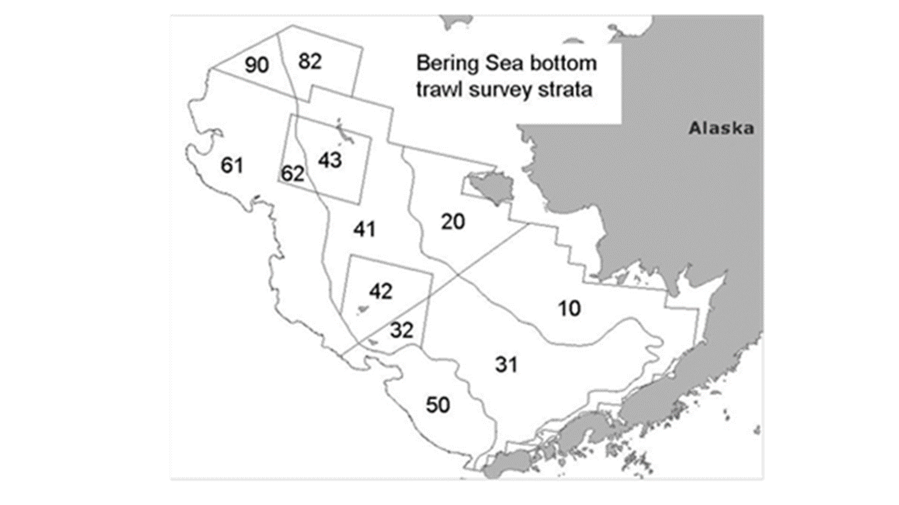

```{r setup, include=FALSE}
library(knitr)
library(ggplot2)
library(gridExtra)
library(GroundfishCondition)
data("lwdata")
lwdata["YEAR"]<-round(lwdata["CRUISE"]/100,digits=1)
head(lwdata)

```

## Eastern Bering Sea Groundfish Condition
Contributed by Jennifer Boldt^1^, Chris Rooper^2^ , and Jerry Hoff^2^   
^1^ Fisheries and Oceans Canada, Pacific Biological Station, 3190 Hammond Bay Rd, Nanaimo, BC, Canada V9T 6N7  
^2^ Resource Assessment and Conservation Engineering Division, Alaska Fisheries Science Center, National Marine Fisheries Service, NOAA  
**Contact**: chris.rooper@noaa.gov  
**Last updated**:  October 2017

**Description of Indicator**: Length-weight residuals are an indicator of somatic growth (Brodeur et al. 2004) and, therefore, a measure of fish condition. Fish condition is an indicator of how heavy a fish is per unit body length, and may be an indicator of ecosystem productivity. Positive length-weight residuals indicate fish are in better condition (i.e., heavier per unit length); whereas, negative residuals indicate fish are in poorer condition (i.e., lighter per unit length). Fish condition may affect fish growth and subsequent survival (Paul 1997, Boldt and Haldorson 2004).

```{r map, include=TRUE,out.width="200%",fig.cap="\\label{fig:figs}Figure 1. NMFS summer bottom trawl survey strata.  Survey strata 31 and 32 were combined as stratum 30; strata 61 and 62 were combined as stratum 60; strata 41, 42, and 43 were combined as stratum 40.  Strata 82 and 90 were excluded from analyses because they are not standard survey strata.",  echo=FALSE}
 
```

The AFSC eastern Bering Sea shelf bottom trawl survey data was utilized to acquire lengths and weights of individual fish for walleye pollock, Pacific cod, arrowtooth flounder, yellowfin sole, flathead sole, northern rock sole, and Alaska plaice. Only summer standard survey strata and stations were included in analyses, no corner stations were included (Figure 1). Survey strata 31 and 32 were combined as stratum 30; strata 61 and 62 were combined as stratum 60; strata 41, 42, and 43 were combined as stratum 40. Strata 82 and 90 were excluded from analyses because they are not standard survey strata. 

Length-weight relationships for each of the seven species were estimated with a linear regression of log-transformed values over all years where data was available (during 1982-2013). Additionally, length-weight relationships for age 1+ walleye pollock (length from 100-250 mm) were also calculated independent from the adult life history stages. Predicted log-transformed weights were calculated and subtracted from measured log-transformed weights to calculate residuals for each fish.  Length-weight residuals were averaged for the entire EBS and for the 6 strata sampled in the standard summer survey. Temporal and spatial patterns in residuals were examined.  

**Status and Trends**: Length-weight residuals have varied over time for all species with a few notable patterns (Figure 2). Residuals for all species where there was data were negative in 1999, a cold year in the Bering Sea. Residuals became positive or more positive in 2002 for five of the seven species examined. Flatfish residuals were generally positive from 2002 to 2004 or 2005 depending on species. Age 1 Walleye Pollock and Pacific cod residuals were positive from 2001 to 2004 or 2005. In 2008, all species except flathead sole and walleye pollock had negative residuals. There has been a distinct negative trend in Pacific cod since a peak value in 2003. Condition of walleye pollock older than age 1 in 2017 was the second lowest on record. Age 1 walleye Pollock and older walleye Pollock were not well correlated in most years. Length-weight residuals for all species were less in 2017 than in 2016 indicating poorer condition in the most recent year (arrowtooth flounder was the only exception).

```{r figure 2 set up, include=FALSE, fig.height=4, fig.width=4,message=FALSE, warning=FALSE}
##EBS Calculations and figures
EBS.species<-c(21740,21741,21720,10261,10210,10110,10285,10130)
EBS.speciesnames<-c("Walleye pollock","Age 1 Walleye Pollock","Pacific cod","Northern rock sole","Yellowfin sole","Arrowtooth flounder","Alaska plaice","Flathead sole")
EBS.lwdata<-subset(lwdata,lwdata["REGION"]=="BS")
EBS.lwdata["STRATUM"]<-round(EBS.lwdata["STRATUM"],digits=-1)
EBS.lwdata<-subset(EBS.lwdata,EBS.lwdata["STRATUM"]<=60&EBS.lwdata["STRATUM"]>0)
p<-substr(EBS.lwdata[,"STATIONID"],2,2)
#p<-strtrim(EBS.lwdata[,"STATIONID"],2)
EBS.lwdata<-subset(EBS.lwdata,p=="-")
EBS.lwdata$SPECIES_CODE<-ifelse(EBS.lwdata$SPECIES_CODE==21740&EBS.lwdata$LENGTH<250&EBS.lwdata$LENGTH>=100, 21741, EBS.lwdata$SPECIES_CODE)
myplot<-list()
lwdata_by_year<-array(dim=c(0,6))
colnames(lwdata_by_year)<-c("species","yrs","ymeans","yn","ysd","yse")
for(i in 1:length(EBS.species)){
	tempdata<-subset(EBS.lwdata,EBS.lwdata$SPECIES_CODE==EBS.species[i])
	tempdata["residuals"]<-lw.resids(tempdata$LENGTH,tempdata$WEIGHT)
	yrs=sort(unique(tempdata$YEAR))
	ymeans=tapply(tempdata$residuals,tempdata$YEAR,mean)
	yn=tapply(tempdata$residuals,tempdata$YEAR,length)
	ysd=tapply(tempdata$residuals,tempdata$YEAR,sd)
	yse=ysd/sqrt(yn)
	data.summary<-data.frame(yrs,ymeans,yn,ysd,yse)
	lwdata_by_year<-rbind(lwdata_by_year,data.summary)
p<-ggplot(data.summary, aes(x = yrs, y = ymeans),cex=2) +  
  geom_bar(position = position_dodge(), stat="identity", fill="cornflowerblue",col="black") + 
  geom_errorbar(aes(ymin=ymeans-yse, ymax=ymeans+yse),width=0.30) +
 xlim(1996.5, 2017.5)+
 ggtitle(paste(EBS.speciesnames[i])) + 
	geom_hline(yintercept=0, color="black")+
  theme_bw() +
  theme(panel.grid.major = element_blank())+
	theme(axis.text.x = element_text(size=8))+
theme(axis.text.y = element_text(size=8))+
theme(axis.title.x = element_text(size=8))+
theme(axis.title.y = element_text(size=8))+
labs(title = paste(EBS.speciesnames[i]), y = "Length-weight residual", x = "Year")
print(p)
pltName <- paste( EBS.speciesnames[i],"plot", sep = '' )
myplot[[pltName]]<-p}

```

```{r figure 2 grid, include=TRUE, echo=FALSE, fig.height=14,fig.width=12,fig.cap="\\label{fig:figs}Figure 2. Length-weight residuals for seven Eastern Bering Sea groundfish sampled in the NMFS standard summer bottom trawl survey, 1997-2017.",  message=FALSE, warning=FALSE}
grid.arrange(grobs=myplot,ncol=2)
```

```{r figure 2 grid png, include=FALSE, echo=FALSE, message=FALSE, warning=FALSE}
png("EBSbyyear.png",width=6,height=7,units="in",res=300)
grid.arrange(grobs=myplot,ncol=2)
dev.off()
write.csv(lwdata_by_year,"EBS_lwdata_by_year.csv",row.names=FALSE)
```

Spatial trends in residuals were also apparent for some species. Generally, fish were in better condition on the outer shelf (strata 50 and 60; Figure 3). For all species except yellowfin sole (which did not occur in outer shelf strata), residuals were almost always positive on the northern outer shelf (stratum 60; Figure 3). For yellowfin sole, residuals were positive in the outermost shelf strata in which they occurred (stratum 40) except in 1999. In addition to having positive residuals on the outer shelf, gadids tended to have negative residuals on the inner shelf (Figure 3). Pollock residuals were generally positive in strata 50 and 60 and negative in strata 10, 20, and 40. Cod residuals were generally positive in stratum 60 and negative in strata 10 and 20. Spatial patterns in flatfish residuals were also apparent but varied among species.  Alaska plaice residuals were almost always negative in stratum 40. Flathead sole residuals were often positive in strata 40 (Figure 2).   

**Factors causing observed trends**: One potential factor causing the observed temporal variability in length-weight residuals is temperature. The year 1999 was a particularly cold year in the Bering Sea and also a year of negative length-weight residuals for all groundfish examined (where data existed). Despite the abundant large crustacean zooplankton and relatively high microzooplankton productivity present in 1999 (Hunt et al. 2008), the spatial distribution of some groundfish species is affected by temperatures and a cold year may, therefore, have affected the spatial overlap of fish and their prey. Cold temperatures may have also affected fish energy requirements and prey productivity. Conversely, the continuing warmer than normal 2016 temperatures across the Bering Sea shelf may have resulted in negative trends for length-weight residuals.

Other factors that could affect length-weight residuals include survey sampling timing and fish migration. The date of the first length-weight data collected annually varied from late May to early June (except 1998, where the first data available was collected in late July). Also, the bottom trawl survey is conducted throughout the summer months, and as the summer progresses, we would expect fish condition to improve. Since the survey begins on the inner shelf and progresses to the outer shelf, the higher fish condition observed on the outer shelf may be due to the fact that they are sampled later in the summer. We also expect that some fish will undergo seasonal and, for some species, ontogenetic migrations through the survey months. For example, seasonal migrations of pollock occur from overwintering areas along the outer shelf to shallow waters (90-140 m) for spawning (Witherell 2000). Pacific cod concentrate on the shelf edge and upper slope (100-250 m) in the winter, and move to shallower waters (generally <100 m) in the summer (Witherell 2000). Arrowtooth flounder are distributed throughout the continental shelf until age 4, then, at older ages, disperse to occupy both the shelf and the slope (Witherell 2000). Flathead sole overwinter along the outer shelf, and move to shallower waters (20-180 m) in the spring (Witherell 2000). Yellowfin sole concentrate on the outer shelf in the winter, and move to very shallow waters (<30 m) to spawn and feed in the summer (Witherell 2000). How these migrations affect the length-weight residuals is unknown at this time.  

```{r figure 3 set up, include=FALSE, fig.height=4, fig.width=4, message=FALSE, warning=FALSE}
#By stratum graphs
lwdata_by_strata<-array(dim=c(0,7))
colnames(lwdata_by_strata)<-c("species","strata","yrs","ymeans","yn","ysd","yse")
for(i in 1:length(EBS.species)){
	tempdata<-subset(EBS.lwdata,EBS.lwdata$SPECIES_CODE==EBS.species[i])
	tempdata["residuals"]<-lw.resids(tempdata$LENGTH,tempdata$WEIGHT)
	yrs=sort(unique(tempdata$YEAR))
ymeans=aggregate(tempdata$residuals,by=list(tempdata$YEAR,tempdata$STRATUM),mean)
ysd=aggregate(tempdata$residuals,by=list(tempdata$YEAR,tempdata$STRATUM),sd)
yn=aggregate(tempdata$residuals,by=list(tempdata$YEAR,tempdata$STRATUM),length)
yse=ysd$x/sqrt(yn$x)
data.summary<-data.frame(species=EBS.species[i],strata=ymeans$Group.2,yrs=ymeans$Group.1,ymeans=ymeans$x,yn=yn$x,ysd=ysd$x,yse=yse)
lwdata_by_strata<-rbind(lwdata_by_strata,data.summary)

dat1 <- subset(data.summary,data.summary$ymeans>=0)
dat2 <- subset(data.summary,data.summary$ymeans< 0)
p2<-ggplot() +
	geom_bar(data = dat1, aes(x=yrs, y=ymeans, fill=factor(strata)),stat = "identity",col="black") +
    geom_bar(data = dat2, aes(x=yrs, y=ymeans, fill=factor(strata)),stat = "identity",col="black")+
 scale_fill_brewer(palette = "Spectral")+
	geom_hline(yintercept=0, color="black")+
 xlim(1996.5, 2017.5)+
theme_bw() +
	theme(axis.text.x = element_text(size=8))+
theme(axis.text.y = element_text(size=8))+
theme(axis.title.x = element_text(size=8))+
theme(axis.title.y = element_text(size=8))+
theme(legend.title = element_text(size=8))+
theme(legend.text = element_text(size=8))+
  theme(panel.grid.major = element_blank())+
 labs(title = paste(EBS.speciesnames[i]), y = "Length-weight residual", x = "Year", fill = "Stratum")
if(i==1){
    p2<-p2+theme(legend.position=c(.07,.65))+theme(legend.title = element_text("Stratum"))+theme(legend.text = element_text(size = 8))}
if(i!=1){p2<-p2+theme(legend.position="none")}
pltName <- paste( EBS.speciesnames[i],"plot", sep = '' )
myplot[[pltName]]<-p2}

```

```{r figure 3 grid, include=TRUE, echo=FALSE, fig.height=14, fig.width=12, fig.cap="\\label{fig:figs}Figure 2. Length-weight residuals for seven Eastern Bering Sea groundfish sampled in the NMFS standard summer bottom trawl survey, 1997-2017, by survey strata (10 - 60).  NMFS summer bottom trawl survey strata are shown in the lower right panel.  Survey strata 31 and 32 were combined as stratum 30; strata 61 and 62 were combined as stratum 60; strata 41, 42, and 43 were combined as stratum 40.  Strata 82 and 90 were excluded from analyses because they are not standard survey strata.",message=FALSE, warning=FALSE}
grid.arrange(grobs=myplot,ncol=2)
```

```{r figure 3 grid png, include=FALSE, echo=FALSE, message=FALSE, warning=FALSE}
png("EBSbystrata.png",width=6,height=7,units="in",res=300)
grid.arrange(grobs=myplot,ncol=2)
dev.off()
write.csv(lwdata_by_strata,"EBS_lwdata_by_strata.csv",row.names=FALSE)
```

**Implications**: A fishes condition may have implications for its survival. For example, in Prince William Sound, the condition of herring prior to the winter may in part determine their survival (Paul and Paul 1999). The condition of Bering Sea groundfish, may therefore partially contribute to their survival and recruitment. In the future, as years are added to the time series, the relationship between length-weight residuals and subsequent survival can be examined further. It is likely, however, that the relationship is more complex than a simple correlation. Also important to consider is the fact that condition of all sizes of fish were examined and used to predict survival. Perhaps, it would be better to examine the condition of juvenile fish, not yet recruited to the fishery, or the condition of adult fish and correlations with survival. This work has not yet been done for the 2017 bottom trawl survey data, but we are preparing a manuscript describing the juvenile-adult condition correlation and further splitting of juvenile and adult fishes and anticipate including it in the 2018 ecosystem contributions.

The reduced condition for all species in 2017 compared to 2016 is a potential cause for concern and may be a leading indicator of poor overwinter survival and the potential for smaller stocks in 2018. It should be noted anecdotally that the commercial fishery was finding pollock in poorer condition during the summer season as well. 