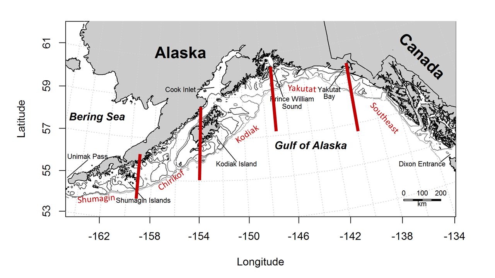

```{r setup, include=FALSE}
library(knitr)
library(ggplot2)
library(gridExtra)
library(GroundfishCondition)
data("lwdata")
lwdata["YEAR"]<-round(lwdata["CRUISE"]/100,digits=1)
head(lwdata)

```

## Gulf of Alaska Groundfish Condition
Contributed by Jennifer Boldt^1^, Chris Rooper^2^ , and Jerry Hoff^2^   
^1^ Fisheries and Oceans Canada, Pacific Biological Station, 3190 Hammond Bay Rd, Nanaimo, BC, Canada V9T 6N7  
^2^ Resource Assessment and Conservation Engineering Division, Alaska Fisheries Science Center, National Marine Fisheries Service, NOAA  
**Contact**: chris.rooper@noaa.gov  
**Last updated**:  October 2017

**Description of Indicator**: Length-weight residuals are an indicator of somatic growth (Brodeur et al. 2004) and, therefore, a measure of fish condition. Fish condition is an indicator of how heavy a fish is per unit body length, and may be an indicator of ecosystem productivity. Positive length-weight residuals indicate fish are in better condition (i.e., heavier per unit length); whereas, negative residuals indicate fish are in poorer condition (i.e., lighter per unit length). Fish condition may affect fish growth and subsequent survival (Paul 1997, Boldt and Haldorson 2004).

```{r map, include=TRUE,out.width="200%",fig.cap="\\label{fig:figs}Figure 1. NMFS summer bottom trawl survey strata in the Gulf of Alaska. Red lines demarcate Gulf of Alaska INPFC Areas",  echo=FALSE}
 
```

The AFSC Gulf of Alaska bottom trawl survey data was utilized to acquire lengths and weights of individual fish for walleye pollock, Pacific cod, arrowtooth flounder, southern rock sole, dusky rockfish, northern rockfish, and Pacific ocean perch.  Only standard survey stations were included in analyses.  Data were combined by INPFC area; Shumagin, Chirikof, Kodiak, Yakutat and Southeast (Figure 1). Length-weight relationships for each of the seven species were estimated with a linear regression of log-transformed values over all years where data was available (during 1984-2017). Additionally, length-weight relationships for age 1+ walleye pollock (length from 100-250 mm) were also calculated independent from the adult life history stage. Predicted log-transformed weights were calculated and subtracted from measured log-transformed weights to calculate residuals for each fish.  Length-weight residuals were averaged for the entire GOA and for the 5 INPFC areas sampled in the standard summer survey.  Temporal and spatial patterns in residuals were examined.  

**Status and Trends**: Length-weight residuals varied over time for all species with a few notable patterns (Figure 1).  Residuals for most species where there was data were positive in the first three years of the survey (1985-1990). The residuals have been mixed for all species since then, generally smaller and varying from year to year. Age 1 pollock have generally been at or near the mean condition since the 1990 survey (although 2017 was a negative condition year). In 2017 condition was reduced from the average for all species except Pacific cod. Fish condition for northern rockfish and arrowtooth flounder was the lowest on record and Pacific Ocean perch and southern rock sole were the second lowest on record. In general, for all species except the gadids there has been a general decrease in body condition since 1990. 

```{r figure 2 set up, include=FALSE, fig.height=4, fig.width=4,message=FALSE, warning=FALSE}
##GOA Calculations and figures
GOA.species<-c(21740,21741,21720,30420,10262,10110,30060,30151)
GOA.speciesnames<-c("Walleye pollock","Age 1 Walleye Pollock","Pacific cod","Northern rockfish","Southern rock sole","Arrowtooth flounder","Pacific Ocean perch","Dusky rockfish")
GOA.lwdata<-subset(lwdata,lwdata["REGION"]=="GOA")
GOA.lwdata<-subset(GOA.lwdata,GOA.lwdata$YEAR>1984&GOA.lwdata$YEAR!=1989)
GOA.lwdata$SPECIES_CODE<-ifelse(GOA.lwdata$SPECIES_CODE==21740&GOA.lwdata$LENGTH<250&GOA.lwdata$LENGTH>=100, 21741, GOA.lwdata$SPECIES_CODE)
GOA.lwdata<-subset(GOA.lwdata,GOA.lwdata["INPFC_AREA"]!="")

myplot<-list()
lwdata_by_year<-array(dim=c(0,6))
colnames(lwdata_by_year)<-c("species","yrs","ymeans","yn","ysd","yse")
for(i in 1:length(GOA.species)){ #set up the loop to loop through species
	tempdata<-subset(GOA.lwdata,GOA.lwdata$SPECIES_CODE==GOA.species[i]) #subset the data to the species of interest
	tempdata["residuals"]<-lw.resids(tempdata$LENGTH,tempdata$WEIGHT) # Use the lw.resids function to calculate the residuals
	yrs=sort(unique(tempdata$YEAR)) #Sort by year
	ymeans=tapply(tempdata$residuals,tempdata$YEAR,mean) #Calculate mean by year
	yn=tapply(tempdata$residuals,tempdata$YEAR,length) #Count the number of observations by year
	ysd=tapply(tempdata$residuals,tempdata$YEAR,sd) #Calculate the sd of the mean by year
	yse=ysd/sqrt(yn) #Calculate the standard error
	data.summary<-data.frame(GOA.species[i],yrs,ymeans,yn,ysd,yse) #Put the mean, SE and year into a data frame for plotting
lwdata_by_year<-rbind(lwdata_by_year,data.summary)

p<-ggplot(data.summary, aes(x = yrs, y = ymeans)) +  
  geom_bar(position = position_dodge(), stat="identity", fill="cornflowerblue",col="black", width=1) + 
  geom_errorbar(aes(ymin=ymeans-yse, ymax=ymeans+yse),width=0.30) +
 xlim(1984.5, 2016.5)+
 ggtitle(paste(GOA.speciesnames[i])) + 
	geom_hline(yintercept=0, color="black")+
  theme_bw() +
  theme(panel.grid.major = element_blank())+
	theme(axis.text.x = element_text(size=8))+
theme(axis.text.y = element_text(size=8))+
theme(axis.title.x = element_text(size=8))+
theme(axis.title.y = element_text(size=8))+
labs(title = paste(GOA.speciesnames[i]), y = "Length-weight residual", x = "Year")
print(p)
pltName <- paste( GOA.speciesnames[i],"plot", sep = '' )
myplot[[pltName]]<-p}#Add the plot to the list and loop

```

```{r figure 2 grid, include=TRUE, echo=FALSE, fig.height=14,fig.width=12,fig.cap="\\label{fig:figs}Figure 2. Length-weight residuals for seven Gulf of Alaska groundfish sampled in the NMFS standard summer bottom trawl survey, 1985-2017.",  message=FALSE, warning=FALSE}
grid.arrange(grobs=myplot,ncol=2)
```

```{r figure 2 grid png, include=FALSE, echo=FALSE, message=FALSE, warning=FALSE}
png("GOAbyyear.png",width=6,height=7,units="in",res=300)
grid.arrange(grobs=myplot,ncol=2)
dev.off()
write.csv(lwdata_by_year,"GOA_lwdata_by_year.csv",row.names=FALSE)
```

Spatial trends in residuals were also apparent for some species (Figure 2).  Most species were generally in better condition in the Kodiak area, especially southern rock sole. The southeastern area was an area where fish condition was generally worse than other areas of the GOA, except for northern rockfish. For Pacific Ocean perch, the Kodiak and Shumagin areas generally had positive length-weight residuals. Arrowtooth flounder and age 1 pollock are the only species with consistently higher residuals in the Yakutat area.

**Factors causing observed trends**: One potential factor causing the observed temporal variability in length-weight residuals may be temperature and local production. The lack of consistent trends in any of the species and any of the areas suggests that local conditions that vary from year to year might be driving condition trends in the Gulf of Alaska.

Other factors that could affect length-weight residuals include survey sampling timing and fish migration.  The date of the first length-weight data collected is generally in the beginning of June and the bottom trawl survey is conducted sequentially throughout the summer months from west to east. Therefore, it is impossible to separate the in-season time trend from the spatial trend in this data. 

```{r figure 3 set up, include=FALSE, fig.height=4, fig.width=4, message=FALSE, warning=FALSE}
#By stratum graphs
lwdata_by_strata<-array(dim=c(0,7))
colnames(lwdata_by_strata)<-c("species","strata","yrs","ymeans","yn","ysd","yse")
for(i in 1:length(GOA.species)){
	tempdata<-subset(GOA.lwdata,GOA.lwdata$SPECIES_CODE==GOA.species[i])
	tempdata["residuals"]<-lw.resids(tempdata$LENGTH,tempdata$WEIGHT)
	yrs=sort(unique(tempdata$YEAR))
	
ymeans=aggregate(tempdata$residuals,by=list(tempdata$YEAR,tempdata$INPFC_AREA),mean)
ysd=aggregate(tempdata$residuals,by=list(tempdata$YEAR,tempdata$INPFC_AREA),sd)
yn=aggregate(tempdata$residuals,by=list(tempdata$YEAR,tempdata$INPFC_AREA),length)
yse=ysd$x/sqrt(yn$x)
data.summary<-data.frame(species=GOA.species[i],strata=ymeans$Group.2,yrs=ymeans$Group.1,ymeans=ymeans$x,yn=yn$x,ysd=ysd$x,yse=yse)
lwdata_by_strata<-rbind(lwdata_by_strata,data.summary)

dat1 <- subset(data.summary,data.summary$ymeans>=0)
dat2 <- subset(data.summary,data.summary$ymeans< 0)
p<-ggplot() +
	geom_bar(data = dat1, aes(x=yrs, y=ymeans, fill=factor(strata,levels=c("Shumagin       ","Chirikof       ","Kodiak         ","Yakutat        ","Southeastern   "))),stat = "identity",col="black",width=1) +
    geom_bar(data = dat2, aes(x=yrs, y=ymeans, fill=factor(strata)),stat = "identity",col="black",width=1)+
 scale_fill_brewer(palette = "Spectral",breaks=c("Shumagin       ","Chirikof       ","Kodiak         ","Yakutat        ","Southeastern   "))+
	geom_hline(yintercept=0, color="black")+
 xlim(1984.5, 2016.5)+
theme_bw() +
	theme(axis.text.x = element_text(size=8))+
theme(axis.text.y = element_text(size=8))+
theme(axis.title.x = element_text(size=8))+
theme(axis.title.y = element_text(size=8))+
theme(legend.title = element_text(size=8))+
theme(legend.text = element_text(size=8))+
  theme(panel.grid.major = element_blank())+
 labs(title = paste(GOA.speciesnames[i]), y = "Length-weight residual", x = "Year", fill = "")
if(i==2){
    p<-p+theme(legend.position=c(.85,.72))+theme(legend.title = element_blank())+theme(legend.text = element_text(size = 8))}
if(i!=2){p<-p+theme(legend.position="none")}
p
pltName <- paste( GOA.speciesnames[i],"plot", sep = '' )
myplot[[pltName]]<-p}

```

```{r figure 3 grid, include=TRUE, echo=FALSE, fig.height=14, fig.width=12, fig.cap="\\label{fig:figs}Figure 3. Length-weight residuals for seven Gulf of Alaska groundfish sampled in the NMFS standard summer bottom trawl survey, 1985-2017, by INPFC area.",message=FALSE, warning=FALSE}
grid.arrange(grobs=myplot,ncol=2)
```

```{r figure 3 grid png, include=FALSE, echo=FALSE, message=FALSE, warning=FALSE}
png("GOAbystrata.png",width=6,height=7,units="in",res=300)
grid.arrange(grobs=myplot,ncol=2)
dev.off()
write.csv(lwdata_by_strata,"GOA_lwdata_by_strata.csv",row.names=FALSE)
```

**Implications**: A fish's condition may have implications for its survival.  For example, in Prince William Sound, the condition of herring prior to the winter may in part determine their survival (Paul and Paul 1999).  The condition of Aleutian Islands groundfish, may therefore partially contribute to their survival and recruitment. In the future, as years are added to the time series, the relationship between length-weight residuals and subsequent survival can be examined further.  It is likely, however, that the relationship is more complex than a simple correlation.  Also important to consider is the fact that condition of all sizes of fish were examined and used to predict survival.  Perhaps, it would be better to examine the condition of juvenile fish, not yet recruited to the fishery, or the condition of adult fish and correlations with survival.  This work has not yet been done for the 2017 bottom trawl survey data, but we are preparing a manuscript describing the juvenile-adult condition correlation and further splitting of juvenile and adult fishes and anticipate including it in the 2018 ecosystem contributions.


The reduced condition for most species in 2015 and 2017 is a potential cause for concern and may be a leading indicator of poor overwinter survival for these species. The warming event that occurred in 2015 may be lingering in the Gulf of Alaska, causing further reductions in fish condition and the potential for smaller stocks in 2018. 